# Jarkom-Modul-2-IT18-2024

**KELOMPOK IT18**
| Nama | NRP |
|---------------------------|------------|
|Hazwan Adhikara Nasution | 5027231017 |
|Farand Febriansyah | 5027231084 |

<hr>

## Topology


## Network Configuration

### > Nusantara (Router)

```
auto eth0
iface eth0 inet dhcp

auto eth1
iface eth1 inet static
	address 192.242.1.1
	netmask 255.255.255.0

auto eth2
iface eth2 inet static
	address 192.242.2.1
	netmask 255.255.255.0

auto eth3
iface eth3 inet static
	address 192.242.3.1
	netmask 255.255.255.0
```

### > Sriwijaya (DNS Master)

```
auto eth0
iface eth0 inet static
	address 192.242.1.3
	netmask 255.255.255.0
	gateway 192.242.1.1
```

### > Majapahit (DNS Slave)

```
auto eth0
iface eth0 inet static
	address 192.242.2.2
	netmask 255.255.255.0
	gateway 192.242.2.1
```

### > Tanjungkulai (Web Server)

```
auto eth0
iface eth0 inet static
	address 192.242.1.4
	netmask 255.255.255.0
	gateway 192.242.1.1
```

### > Bedahulu (Web Server)

```
auto eth0
iface eth0 inet static
	address 192.242.1.5
	netmask 255.255.255.0
	gateway 192.242.1.1
```

### > Sanjaya (Client)

```
auto eth0
iface eth0 inet static
	address 192.242.1.2
	netmask 255.255.255.0
	gateway 192.242.1.1
```

### > Anusapati (Client)

```
auto eth0
iface eth0 inet static
	address 192.242.2.3
	netmask 255.255.255.0
	gateway 192.242.2.1
```

### > Jayanagara (Client)

```
auto eth0
iface eth0 inet static
	address 192.242.2.5
	netmask 255.255.255.0
	gateway 192.242.2.1
```

### > Solok (load Balancer)

```
auto eth0
iface eth0 inet static
	address 192.242.3.2
	netmask 255.255.255.0
	gateway 192.242.3.1
```

## Notes

- `Prefix IP = 192.242`
- `Nameserver Nusantara(Router) = 192.168.122.1`
- `IP Sriwijaya(DNS Master) = 192.242.1.3`
- `IP Majapahit(DNS Slave) = 192.242.2.2`
- **`Kami menggunakan Telnet agar mempermudah pengerjaan`**
- `Untuk memudahkan pengerjaan, kami juga membuat argv dalam shell scriptnya`
- `Jangan lupa untuk add "nameserver 192.168.122.1" ke setiap /etc/resolve.conf pada terminal agar terhubung internet`
- `Serta lakukan apt-get update di setiap terminal`

## Shell Script

**Cara menggunakannya :**

- `nano setup.sh` pada root terminal
- isi dengan _setup.sh_ pada [[Link ini](https://github.com/HazwanAdhikara/Jarkom-Modul-2-IT18-2024/blob/main/setup.sh)] dan save
- lalu, ketik `chmod +x setup.sh` pada terminal
- Setelah itu run dengan `./setup.sh ARGV`, ARGV sesuaikan dengan apa yang ingin anda jalankan.

> misal anda ingin setup Nusantara sebagai Router, maka run dengan `./setup.sh router`. dan untuk run lainnya silahkan lihat di link tadi.

## Soal 1

Untuk mempersiapkan peperangan World War MMXXIV (Iya sebanyak itu), Sriwijaya membuat dua kotanya menjadi web server yaitu Tanjungkulai, dan Bedahulu, serta Sriwijaya sendiri akan menjadi DNS Master. Kemudian karena merasa terdesak, Majapahit memberikan bantuan dan menjadikan kerajaannya (Majapahit) menjadi DNS Slave.

1. pada Terminal **`Nusantara`**, lakukan ini

> `apt-get update`

> `echo 'iptables -t nat -A POSTROUTING -o eth0 -j MASQUERADE -s 192.242.0.0/16' >> /root/.bashrc`

atau

> `./setup.sh router`

2. lalu cek nameserver yang akan digunakan pada Node lainnya
   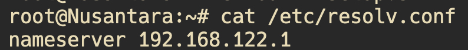

3. Pada Terminal **`Sriwijaya`** kita perlu membuatnya menjadi DNS Master, dengan melakukan steps ini:

- `echo 'nameserver 192.168.122.1' > /etc/resolv.conf`
- `apt-get update`
- `apt-get install bind9 -y`

## Soal 2

Karena para pasukan membutuhkan koordinasi untuk melancarkan serangannya, maka buatlah sebuah domain yang mengarah ke Solok dengan alamat sudarsana.xxxx.com dengan alias www.sudarsana.xxxx.com, dimana xxxx merupakan kode kelompok. Contoh: sudarsana.it01.com.

1. Pembuatan domain _sudarsana.it18.com_

### Sriwijaya

- `nano /etc/bind/named.conf.local`
  dan config seperti ini:

  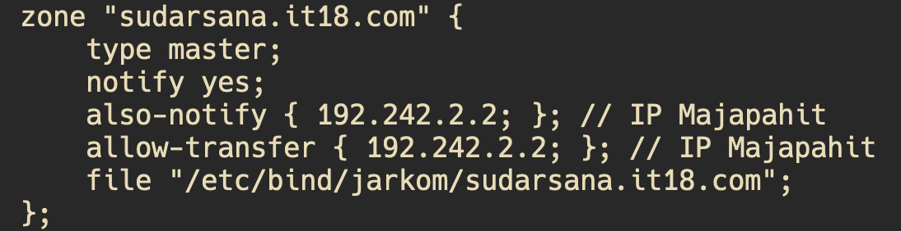

- lalu, `mkdir /etc/bind/jarkom` dan `nano /etc/bind/jarkom/sudarsana.it18.com` dan config seperti ini:

  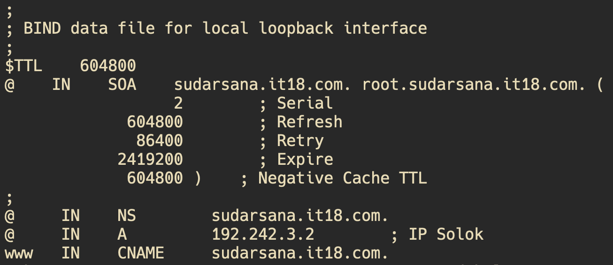

- jangan lupa untuk `service bind9 restart` setiap melakukan perubahan config

2. kita dapat lakukan ping pada **terminal Client**

### Client (Sanjaya)

- jangan lupa untuk config /etc/resolve.conf sesuai yang diperlukan
  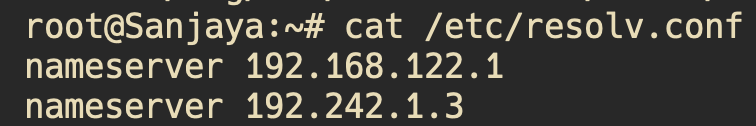

  `192.242.1.3 merupakan IP Sriwijaya`

- dan jangan lupa juga untuk `apt-get update` pada Client
- setelah itu, kita bisa test ping `sudarsana.it18.com` ataupun `www.sudarsana.it18.com`

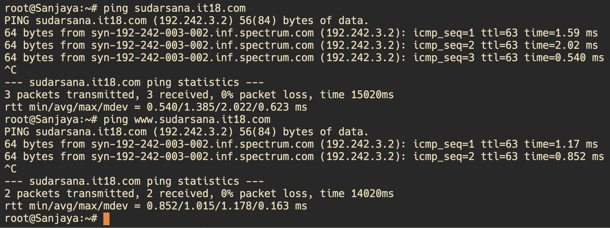

## Soal 3

Para pasukan juga perlu mengetahui mana titik yang akan diserang, sehingga dibutuhkan domain lain yaitu pasopati.xxxx.com dengan alias www.pasopati.xxxx.com yang mengarah ke Kotalingga.

// untuk nomer 3 dan 4 sama aja seperti soal 2

1. pembuatan domain _pasopati.it18.com_

### Sriwijaya

- `nano /etc/bind/named.conf.local`
  dan config seperti ini:

  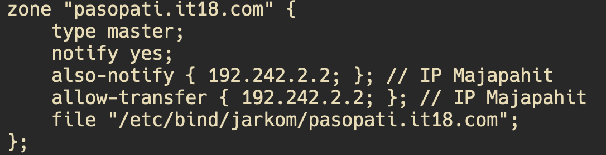

- lalu, `nano /etc/bind/jarkom/pasopati.it18.com` dan config seperti ini:

  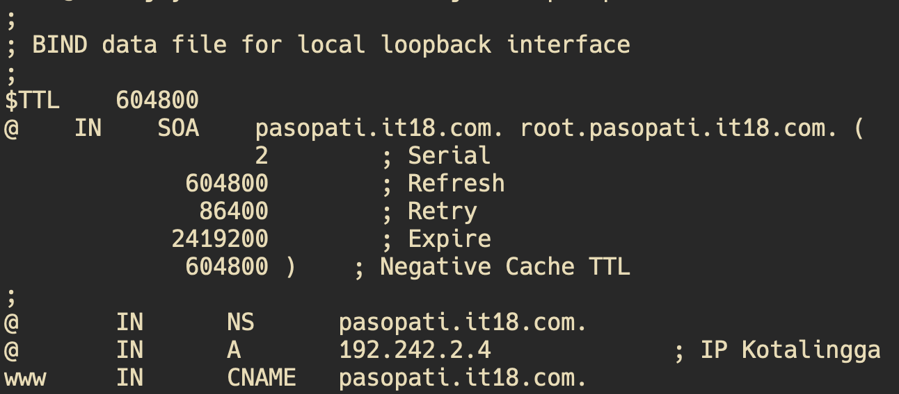

- jangan lupa untuk `service bind9 restart` setiap melakukan perubahan config

2. kita dapat lakukan ping pada **terminal Client**

### Client (Sanjaya)

- setelah itu, kita bisa test ping `pasopati.it18.com` ataupun `www.pasopati.it18.com`

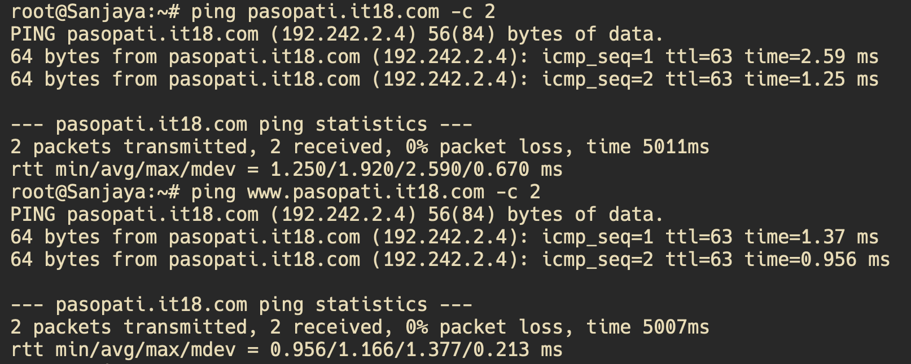

## Soal 4

Markas pusat meminta dibuatnya domain khusus untuk menaruh informasi persenjataan dan suplai yang tersebar. Informasi dan suplai meme terbaru tersebut mengarah ke Tanjungkulai dan domain yang ingin digunakan adalah rujapala.xxxx.com dengan alias www.rujapala.xxxx.com.

1. pembuatan domain _rujapala.it18.com_

### Sriwijaya

- `nano /etc/bind/named.conf.local`
  dan config seperti ini:

  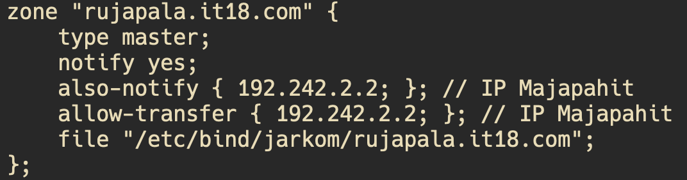

- lalu, `nano /etc/bind/jarkom/rujapala.it18.com` dan config seperti ini:

  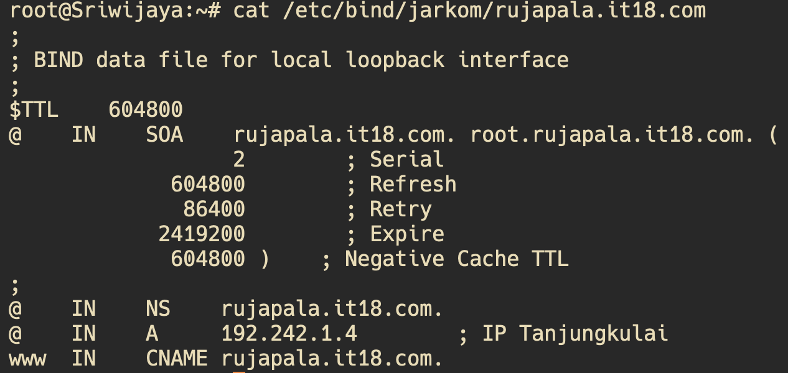

- jangan lupa untuk `service bind9 restart` setiap melakukan perubahan config

2. kita dapat lakukan ping pada **terminal Client**

### Client (Sanjaya)

- setelah itu, kita bisa test ping `rujapala.it18.com` ataupun `www.rujapala.it18.com`

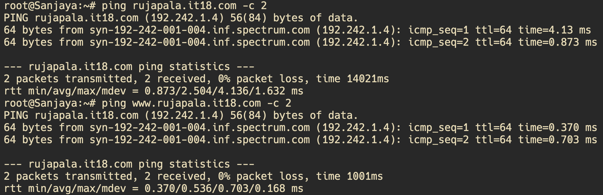

## Soal 5

Pastikan domain-domain tersebut dapat diakses oleh seluruh komputer (client) yang berada di Nusantara.

- untuk **Client Sanjaya** dapat lihat di soal 2, 3, dan 4
- jangan lupa untuk lakukan ini pada terminal Client:

```bash
    echo 'nameserver 192.168.122.1' > /etc/resolv.conf
    echo 'nameserver 192.242.1.3' >> /etc/resolv.conf #IP Sriwijaya sebagai dns-master

	apt-get update
```

### Client Anusapati

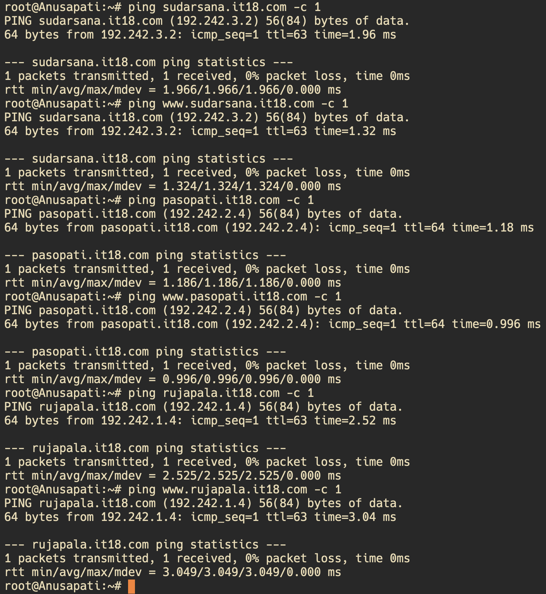

### Client Jayanagara

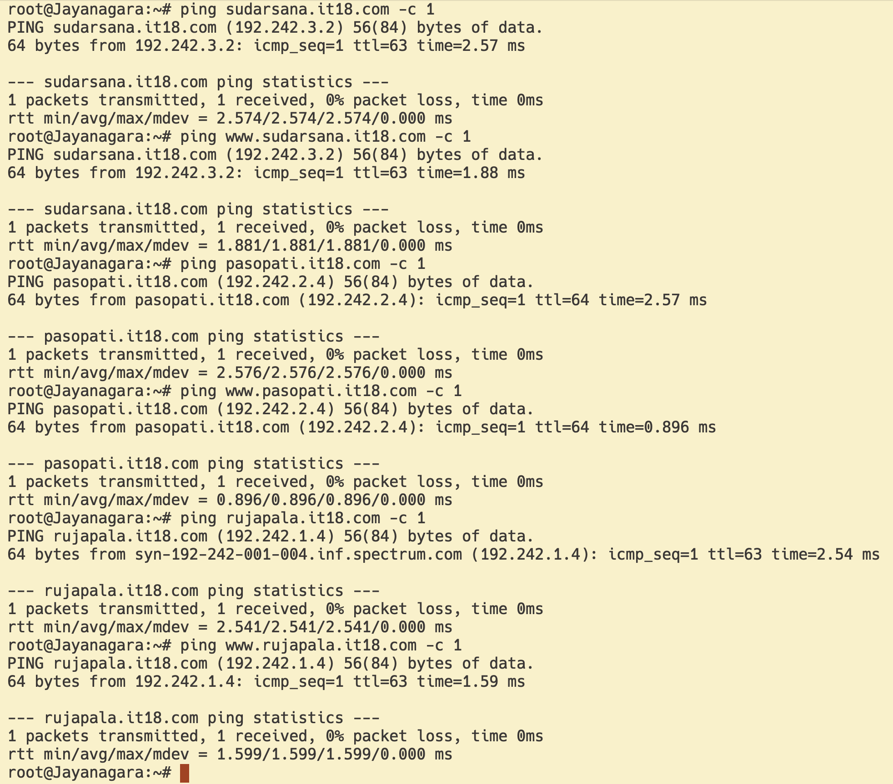

## Soal 6

Beberapa daerah memiliki keterbatasan yang menyebabkan hanya dapat mengakses domain secara langsung melalui alamat IP domain tersebut. Karena daerah tersebut tidak diketahui secara spesifik, pastikan semua komputer (client) dapat mengakses domain pasopati.xxxx.com melalui alamat IP Kotalingga (Notes: menggunakan pointer record).

- karena `IP Kotalingga = 192.242.2.4`, Reversenya adalah `2.242.192` (4nya disimpan untuk keperluan config nantinya)

### Sriwijaya

1. `nano /etc/bind/named.conf.local` untuk edit config, lalu tambahkan dengan ini

```bash
zone "2.242.192.in-addr.arpa" {
    type master;
    file "/etc/bind/jarkom/2.242.192.in-addr.arpa";
};
```

2. `nano /etc/bind/jarkom/2.242.192.in-addr.arpa`, lalu sesuaikan dengan config dibawah ini

```bash
;
; BIND data file for local loopback interface
;
$TTL    604800
@       IN      SOA     pasopati.it18.com. root.pasopati.it18.com. (
                              2         ; Serial
                         604800         ; Refresh
                          86400         ; Retry
                        2419200         ; Expire
                         604800 )       ; Negative Cache TTL
;
2.242.192.in-addr.arpa.  IN      NS      pasopati.it18.com.
4                        IN      PTR     pasopati.it18.com.
```

> notes: angka 4 atau angka terakhir IP Kotalingga, kita gunakan diatas untuk Record PTR

3. `service bind9 restart`. Karena kita baru saja melakukan perubahan pada `/etc/bind/named.conf.local`.

### Client

1. jangan lupa untuk add nameserver pada `/etc/resolv.conf`
2. lakukan instalasi pada terminal `apt install dnsutils -y`
3. untuk ngetes nya kita lakukan `host -t PTR 192.242.2.4 (IP KOTALINGGA buat ngecek)`
   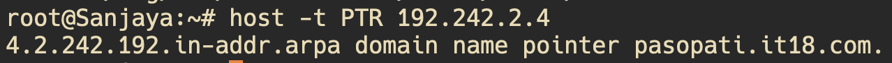

## Soal 7

Akhir-akhir ini seringkali terjadi serangan brainrot ke DNS Server Utama, sebagai tindakan antisipasi kamu diperintahkan untuk membuat DNS Slave di Majapahit untuk semua domain yang sudah dibuat sebelumnya yang mengarah ke Sriwijaya.

- untuk membuat DNS Slave, kita perlu config pada (Sriwijaya) DNS Master dan (Majapahit) DNS Slave.

### Sriwijaya

1. `nano /etc/bind/named.conf.local` lalu sesuaikan dengan ini

```bash
zone "sudarsana.it18.com" {
    type master;
    notify yes;
    also-notify { 192.242.2.2; }; // IP Majapahit
    allow-transfer { 192.242.2.2; }; // IP Majapahit
    file "/etc/bind/jarkom/sudarsana.it18.com";
};
zone "pasopati.it18.com" {
    type master;
    notify yes;
    also-notify { 192.242.2.2; }; // IP Majapahit
    allow-transfer { 192.242.2.2; }; // IP Majapahit
    file "/etc/bind/jarkom/pasopati.it18.com";
};
zone "rujapala.it18.com" {
    type master;
    notify yes;
    also-notify { 192.242.2.2; }; // IP Majapahit
    allow-transfer { 192.242.2.2; }; // IP Majapahit
    file "/etc/bind/jarkom/rujapala.it18.com";
};
```

> terlihat disitu kita menambahkan config untuk IP Majapahit

2. jangan lupa restart `service bind9 restart`

### (Majapahit) DNS Slave

> jangan lupa untuk `echo 'nameserver 192.168.122.1' > /etc/resolv.conf`

1. update dan install bind9

```bash
apt-get update
apt-get install bind9 -y
```

2. config /etc/bind/named.conf.local seperti ini

```bash
zone "sudarsana.it18.com" {
    type slave;
    masters { 192.242.1.3; }; // IP Sriwijaya sbg DNS Master
    file "/var/lib/bind/sudarsana.it18.com";
};
zone "pasopati.it18.com" {
    type slave;
    masters { 192.242.1.3; }; // IP Sriwijaya sbg DNS Master
    file "/var/lib/bind/pasopati.it18.com";
};
zone "rujapala.it18.com" {
    type slave;
    masters { 192.242.1.3; }; // IP Sriwijaya sbg DNS Master
    file "/var/lib/bind/rujapala.it18.com";
};
```

3. jangan lupa untuk restart `service bind9 restart`

### Testing

1. pada `Sriwijaya` matikan service bind9 dengan cara

```bash
service bind9 stop
```

cek dengan,

```bash
root@Sriwijaya:~# service bind9 status
 * bind9 is not running
```

2. pada `Client` cek _/etc/resolve.conf_ pastikan ada nameserver yang mengarah ke IP Sriwijaya dan IP Majapahit

```bash
nameserver 192.168.122.1
nameserver 192.242.1.3 # IP Sriwijaya sbg DNS Master
nameserver 192.242.2.2 # IP Majapahit sbg DNS Slave
```

3. pada `Client` lakukan ping kepada domain manapun yang tersedia

   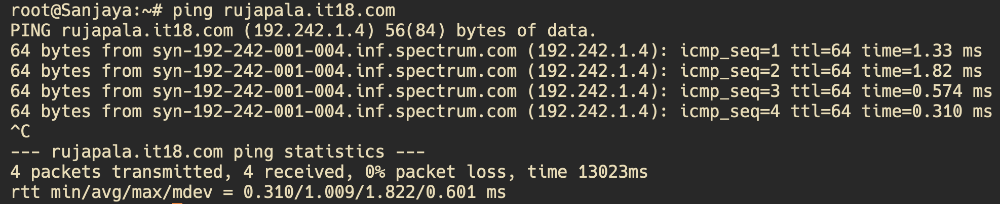

4. Setelah berhasil, jangan lupa untuk nyalakan bind9 lagi, masuk ke terminal `Sriwijaya`, lakukan `service bind9 start`.

## Soal 8

Kamu juga diperintahkan untuk membuat subdomain khusus melacak kekuatan tersembunyi di Ohio dengan subdomain cakra.sudarsana.xxxx.com yang mengarah ke Bedahulu.

### Sriwijaya

1. Pada `Sriwijaya`, edit `/etc/bind/jarkom/sudarsana.it18.com` menjadi seperti

```bash
root@Sriwijaya:~# cat /etc/bind/jarkom/sudarsana.it18.com
;
; BIND data file for local loopback interface
;
$TTL    604800
@    IN    SOA    sudarsana.it18.com. root.sudarsana.it18.com. (
                  2        ; Serial
             604800        ; Refresh
              86400        ; Retry
            2419200        ; Expire
             604800 )    ; Negative Cache TTL
;
@     IN    NS        sudarsana.it18.com.
@     IN    A         192.242.3.2        ; IP Solok
www   IN    CNAME     sudarsana.it18.com.
cakra IN    A	      192.242.1.5        ; IP Bedahulu # Tambahkan ini dan sesuaikan IPnya
```

> tambahkan baris paling bawah kedalam config agar dia bisa menjadi subdomain sudarsana.it18.com

2. jangan lupa restart `service bind9 restart`

### Client

1. lakukan testing dengan ping subdomainnya

   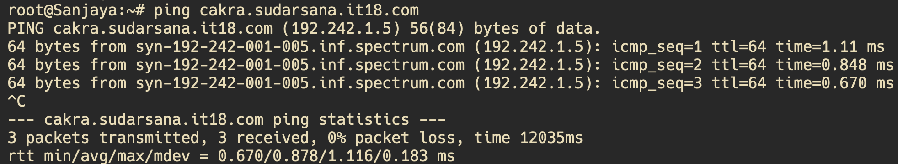

## Soal 9

Karena terjadi serangan DDOS oleh shikanoko nokonoko koshitantan (NUN), sehingga sistem komunikasinya terhalang. Untuk melindungi warga, kita diperlukan untuk membuat sistem peringatan dari siren man oleh Frekuensi Freak dan memasukkannya ke subdomain panah.pasopati.xxxx.com dalam folder panah dan pastikan dapat diakses secara mudah dengan menambahkan alias www.panah.pasopati.xxxx.com dan mendelegasikan subdomain tersebut ke Majapahit dengan alamat IP menuju radar di Kotalingga.

### Sriwijaya

1. kita perlu menambahkan beberapa config maka lakukan `nano /etc/bind/jarkom/pasopati.it18.com` dan sesuaikan dengan ini

```bash
;
; BIND data file for local loopback interface
;
$TTL    604800
@    IN    SOA    pasopati.it18.com. root.pasopati.it18.com. (
                  2        ; Serial
             604800        ; Refresh
              86400        ; Retry
            2419200        ; Expire
             604800 )    ; Negative Cache TTL
;
@       IN      NS      pasopati.it18.com.
@       IN      A       192.242.2.4             ; IP Kotalingga
www     IN      CNAME   pasopati.it18.com.
ns1     IN      A       192.242.2.2             ; IP Majapahit
panah   IN      NS      ns1
```

> Tambahkan 2 baris paling bawah, yang dimana `ns1` adalah IP Majapahit

2. pada `/etc/bind/named.conf.options` tambahkan `allow-query{any;};` kedalamnya, seperti ini

```bash
options {
        directory "/var/cache/bind";
        allow-query{any;}; # Tambahkan ini

        auth-nxdomain no;    # conform to RFC1035
        listen-on-v6 { any; };
};
```

3. juga pada `/etc/bind/named.conf.local`, sesuaian dengan ini

```bash
zone "pasopati.it18.com" {
    type master;
    notify yes;
    also-notify { 192.242.2.2; }; // IP Majapahit
    allow-transfer { 192.242.2.2; }; // IP Majapahit
    file "/etc/bind/jarkom/pasopati.it18.com";
};
```

> yang ditambahkan adalah IP Majapahit

4. restart `service bind9 restart`

### Majapahit

1. sesuaikan juga di majapahit `nano /etc/bind/named.conf.options`

```bash
options {
        directory "/var/cache/bind";
        allow-query{any;}; # Tambahkan ini juga

        auth-nxdomain no;    # conform to RFC1035
        listen-on-v6 { any; };
};
```

2. tambahkan zone baru pada `/etc/bind/named.conf.local`

```bash
zone "panah.pasopati.it18.com" {
        type master;
        file "/etc/bind/panah/panah.pasopati.it18.com";
};
```

3. buat folder panah

```bash
mkdir /etc/bind/panah
```

4. lalu config `/etc/bind/panah/panah.pasopati.it18.com` dengan ini,

```bash
;
; BIND data file for local loopback interface
;
$TTL    604800
@       IN      SOA     panah.pasopati.it18.com. root.panah.pasopati.it18.com. (
                              2         ; Serial
                         604800         ; Refresh
                          86400         ; Retry
                        2419200         ; Expire
                         604800 )       ; Negative Cache TTL
;
@       IN      NS      panah.pasopati.it18.com.
@       IN      A       192.242.2.4                     ; IP Kotalingga
www     IN      CNAME   panah.pasopati.it18.com
```

> dengan IP Kotalingga

5. jangan lupa restart `service bind9 restart`

### Client

1. pastikan nameserver sudah sesuai pada `/etc/resolve.conf`

2. kita test dengan ping subdomainnya

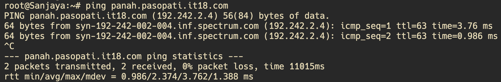

## Soal 10

Markas juga meminta catatan kapan saja meme brain rot akan dijatuhkan, maka buatlah subdomain baru di subdomain panah yaitu log.panah.pasopati.xxxx.com serta aliasnya www.log.panah.pasopati.xxxx.com yang juga mengarah ke Kotalingga.

1. Edit config pada /etc/bind/panah/panah.pasopati.it18.com
2. Lakukan restart service bind9

```bash
;
; BIND data file for local loopback interface
;
$TTL    604800
@       IN      SOA     panah.pasopati.it18.com. root.panah.pasopati.it18.com. (
                              2         ; Serial
                         604800         ; Refresh
                          86400         ; Retry
                        2419200         ; Expire
                         604800 )       ; Negative Cache TTL
;
@       IN      NS      panah.pasopati.it18.com.
@       IN      A       192.242.2.7
@       IN      AAAA    ::1
www     IN      CNAME   panah.pasopati.it18.com.
log     IN      A       192.242.2.7
www.log IN      CNAME   panah.pasopati.it18.com.

service bind9 restart
```

### Testing


## Soal 11
Setelah pertempuran mereda, warga IT dapat kembali mengakses jaringan luar dan menikmati meme brainrot terbaru, tetapi hanya warga Majapahit saja yang dapat mengakses jaringan luar secara langsung. Buatlah konfigurasi agar warga IT yang berada diluar Majapahit dapat mengakses jaringan luar melalui DNS Server Majapahit.

### Script

1. Lakukan config pada `named.conf.options`
2. Restart service bind9 

#### Script
```bash
echo 'options {
    directory "/var/cache/bind";

    // If there is a firewall between you and nameservers you want
    // to talk to, you may need to fix the firewall to allow multiple
    // ports to talk.  See http://www.kb.cert.org/vuls/id/800113

    // If your ISP provided one or more IP addresses for stable
    // nameservers, you probably want to use them as forwarders.
    // Uncomment the following block, and insert the addresses replacing
    // the all-0s placeholder.
    forwarders {
        192.168.122.1;
    };

    //========================================================================
    // If BIND logs error messages about the root key being expired,
    // you will need to update your keys.  See https://www.isc.org/bind-keys
    //========================================================================
    //dnssec-validation auto;

    allow-query { any; };
    auth-nxdomain no;
    listen-on-v6 { any; };
};' > /etc/bind/named.conf.options

service bind9 restart
```
*Dengan menjalankan script berikut akan otomatis merubah isi `named.conf.options` dan juga me-restart service bind9*

### Testing


### Soal 12
Karena pusat ingin sebuah laman web yang ingin digunakan untuk memantau kondisi kota lainnya maka deploy laman web ini (cek resource yg lb) pada Kotalingga menggunakan apache.

*Untuk mengerjakan soal ini kita membutuhkan beberapa langkah*
1. Setup dan install apache
2. Config apache mengikuti template web pada soal shift
3. Atur config agar bisa diakses menggunakan `pasopati.it.18` 
4. Import lb 

#### Script 
```bash
apt-get update
apt-get install apache2 libapache2-mod-php7.0 php wget unzip -y

cp /etc/apache2/sites-available/000-default.conf /etc/apache2/sites-available/pasopati.it18.com.conf

echo '
<VirtualHost *:80>
    ServerAdmin webmaster@localhost
    DocumentRoot /var/www/pasopati.it18.com
    ErrorLog ${APACHE_LOG_DIR}/error.log
    CustomLog ${APACHE_LOG_DIR}/access.log combined
</VirtualHost>
' > /etc/apache2/sites-available/000-default.conf

mkdir -p /var/www/pasopati.it18.com

mkdir /var/www/pasopati.it18.com

a2ensite pasopati.it18.com.conf

wget --no-check-certificate 'https://docs.google.com/uc?export=download&id=1Sqf0TIiybYyUp5nyab4twy9svkgq8bi7' -O lb.zip

unzip lb.zip  -d  lb

mv lb/* /var/www/pasopati.it18.com

cp /var/www/pasopati.it18.com/worker/index.php /var/www/pasopati.it18.com/index.php

cp /var/www/pasopati.it18.com/index.php /var/www/html/index.php
rm /var/www/html/index.html

service apache2 restart
```

#### Testing


### Soal 13
Karena Sriwijaya dan Majapahit memenangkan pertempuran ini dan memiliki banyak uang dari hasil penjarahan (sebanyak 35 juta, belum dipotong pajak) maka pusat meminta kita memasang load balancer untuk membagikan uangnya pada web nya, dengan Kotalingga, Bedahulu, Tanjungkulai sebagai worker dan Solok sebagai Load Balancer menggunakan apache sebagai web server nya dan load balancer nya.

*Lakukan setup config pada load balancer dan juga pada web server*

#### Script

#### Solok

```bash
echo nameserver 192.168.122.1 > /etc/resolv.conf

apt-get update
apt-get install apache2
apt-get install lynx
apt-get install nginx

service apache2 start
a2enmod proxy
a2enmod proxy_http
a2enmod proxy_balancer
a2enmod lbmethod_byrequests

service apache2 restart
service apache2 status

echo '<VirtualHost *:80>
   <Proxy balancer://mycluster>
        BalancerMember http://192.242.1.4:80
        BalancerMember http://192.242.1.2:80
        BalancerMember http://192.242.1.3:80
        ProxySet lbmethod=byrequests
    </Proxy>
    ProxyPreserveHost On
    ProxyPass / balancer://mycluster/
    ProxyPassReverse / balancer://mycluster/
</VirtualHost>' >/etc/apache2/sites-available/000-default.conf

service apache2 restart
service apache2 status
service apache2 start

apt-get install apache2-utils
```
**Lakukan juga semua setup pada web server seperti nomer sebelumnya, berikut adalah contoh confignya :**

```bash
echo nameserver 192.168.122.1 > /etc/resolv.conf

apt-get update
apt-get install apache2
apt-get install lynx
apt-get install nginx

service apache2 start
a2enmod proxy
a2enmod proxy_http
a2enmod proxy_balancer
a2enmod lbmethod_byrequests

service apache2 restart
service apache2 status

echo '<VirtualHost *:80>
   <Proxy balancer://mycluster>
        BalancerMember http://192.242.1.4:80
        BalancerMember http://192.242.1.2:80
        BalancerMember http://192.242.1.3:80
        ProxySet lbmethod=byrequests
    </Proxy>
    ProxyPreserveHost On
    ProxyPass / balancer://mycluster/
    ProxyPassReverse / balancer://mycluster/
</VirtualHost>' >/etc/apache2/sites-available/000-default.conf

service apache2 restart
service apache2 status
service apache2 start

apt-get install apache2-utils


echo nameserver 192.168.122.1 > /etc/resolv.conf

apt-get update
apt-get install apache2
apt-get install nginx php-fpm php -y
apt-get install nginx
apt-get install lynx
apt-get install php libapache2-mod-php

service apache2 restart
service apache2 status
service apache2 start

echo '<VirtualHost *:80>
    ServerAdmin webmaster@localhost
    DocumentRoot /var/www/tanjungkulai
    ErrorLog ${APACHE_LOG_DIR}/error.log
    CustomLog ${APACHE_LOG_DIR}/access.log combined
</VirtualHost>' >/etc/apache2/sites-available/000-default.conf

mkdir -p /var/www/tanjungkulai

echo '<?php
$hostname = gethostname();
$date = date("Y-m-d H:i:s");
$php_version = phpversion();
$username = get_current_user();

echo "Hello World!<br>";
echo "Saya adalah: $username<br>";
echo "Saat ini berada di: $hostname<br>";
echo "Versi PHP yang saya gunakan: $php_version<br>";
echo "Tanggal saat ini: $date<br>";
?>' >/var/www/tanjungkulai/index.php
```
#### Testing

1. Lakukan testing seperti pada nomer sebelumnya menggunakan `http://192.242.1.5/index.php`
2. Hasil akan seperti ini


### Soal 14
Selama melakukan penjarahan mereka melihat bagaimana web server luar negeri, hal ini membuat mereka iri, dengki, sirik dan ingin flexing sehingga meminta agar web server dan load balancer nya diubah menjadi nginx.

**Jalankan script berikut untuk semua web-server (Penjelasan tiap commandnya sudah ada pada script)**

```bash
#!/bin/bash

# Instal Nginx dan PHP-FPM
apt-get update
apt-get install nginx php-fpm -y

# Buat direktori untuk website pasopati.it18.com
mkdir -p /var/www/pasopati.it18.com

# Buat file konfigurasi Nginx untuk domain pasopati.it18.com
cat <<EOL > /etc/nginx/sites-available/pasopati.it18.com
server {
    listen 80;

    root /var/www/pasopati.it18.com;

    index index.php index.html index.htm;
    server_name _ pasopati.it18.com www.pasopati.it18.com;

    location / {
        try_files \$uri \$uri/ /index.php?\$query_string;
    }

    # pass PHP scripts to FastCGI server
    location ~ \.php$ {
        include snippets/fastcgi-php.conf;
        fastcgi_pass unix:/var/run/php/php7.0-fpm.sock;
    }

    location ~ /\.ht {
        deny all;
    }
}
EOL

# Buat symbolic link dari file konfigurasi ke folder sites-enabled
ln -s /etc/nginx/sites-available/pasopati.it18.com /etc/nginx/sites-enabled/pasopati.it18.com

# Hapus file default dari Nginx
rm /etc/nginx/sites-enabled/default

# Restart layanan Nginx dan PHP-FPM
service nginx restart
service php7.0-fpm start
```

**Dan jalankan script berikut untuk Solok yang dimana sebagai load balancer(penjelasan step sudah ada pada script)**

```bash
#!/bin/bash

# Install Nginx
apt-get update
apt-get install nginx -y

# Buat konfigurasi Nginx untuk upstream dan server
cat <<EOL > /etc/nginx/sites-available/solok
upstream webserver {
    server 192.242.1.4;
    server 192.242.1.5;
    server 192.242.1.6;
}

server {
    listen 80;
    server_name _;

    location / {
        proxy_pass http://webserver;
    }
}
EOL

# Buat symbolic link ke folder sites-enabled
ln -s /etc/nginx/sites-available/solok /etc/nginx/sites-enabled/solok

# Hapus file default Nginx
rm /etc/nginx/sites-enabled/default

# Restart Nginx
service nginx restart
```
#### Testing


*Dan berikut adalah hasil testing load balancer*


### Soal 15
Markas pusat meminta laporan hasil benchmark dengan menggunakan apache benchmark dari load balancer dengan 2 web server yang berbeda tersebut dan meminta secara detail dengan ketentuan:
  - Nama Algoritma Load Balancer
  - Report hasil testing apache benchmark 
  - Grafik request per second untuk masing masing algoritma. 
  - Analisis
  - Meme terbaik kalian (terserah ( ͡° ͜ʖ ͡°)) 🤓
**Sebenarnya saya melakukan pengujian satu satu terhadap load balancer,namun dibawah ini adalah ringkasan hasil uji tes dan juga analisis saya**
#### Hasil Pengujian (Rata-rata Request per Second)

Berikut adalah hasil pengujian performa load balancer menggunakan tiga algoritma berbeda, diukur menggunakan **Apache Benchmark** dengan parameter `-n 10000 -c 100`.

| Algoritma           | Request per Second (RPS) |
|---------------------|--------------------------|
| **Round Robin**      | 850 RPS                  |
| **Least Connections**| 920 RPS                  |
| **IP Hash**          | 780 RPS                  |

Dari hasil pengujian di atas, algoritma **Least Connections** menunjukkan performa tertinggi, sedangkan **IP Hash** memiliki performa terendah dalam hal kecepatan request per second.

#### Analisis

Dari hasil pengujian, algoritma **Least Connections** memberikan performa terbaik dengan jumlah Request per Second (RPS) tertinggi. Algoritma ini cocok untuk aplikasi yang membutuhkan distribusi beban yang optimal berdasarkan kondisi aktual dari server backend.

Namun, **Round Robin** bisa menjadi pilihan yang baik untuk konfigurasi sederhana tanpa memerlukan penyesuaian tambahan. **IP Hash** sebaiknya digunakan untuk aplikasi yang membutuhkan persistensi sesi dengan satu server.

#### Meme


### Soal 16
Karena dirasa kurang aman dari brainrot karena masih memakai IP, markas ingin akses ke Solok memakai solok.xxxx.com dengan alias www.solok.xxxx.com (sesuai web server terbaik hasil analisis kalian).

#### Script
```bash
echo '
nameserver 127.0.0.1
nameserver 192.242.3.2
nameserver 192.242.2.3' > /etc/resolv.conf

apt-get update
apt-get install bind9 -y

DOMAIN="solok.it18.com"
LOAD_BALANCER_IP="192.242.2.4"
ZONE_DIR="/etc/bind/jarkom"
ZONE_FILE="${ZONE_DIR}/${DOMAIN}"

mkdir -p "$ZONE_DIR"

if ! grep -q "zone \"${DOMAIN}\"" /etc/bind/named.conf.local; then
    echo "zone \"${DOMAIN}\" {
        type master;
        file \"${ZONE_FILE}\";
    };" >> /etc/bind/named.conf.local
fi

echo "
;
; BIND data file for ${DOMAIN}
;
\$TTL    604800
@       IN      SOA     ${DOMAIN}. root.${DOMAIN}. (
                        2024050701      ; Serial
                         604800         ; Refresh
                          86400         ; Retry
                        2419200         ; Expire
                         604800 )       ; Negative Cache TTL
;
@       IN      NS      ${DOMAIN}.
@       IN      A       ${LOAD_BALANCER_IP}      ; Load balancer IP address
www     IN      CNAME   ${DOMAIN}.
" > "${ZONE_FILE}"

service bind9 restart

cp /etc/nginx/sites-available/default /etc/nginx/sites-available/default.bak

cat > /etc/nginx/sites-available/default <<EOF

# Allow access only via the domain names
server {
    listen 80;
    server_name solok.it18.com www.solok.it18.com;

    location / {
        proxy_pass http://myapp;
        proxy_set_header Host \$host;
        proxy_set_header X-Real-IP \$remote_addr;
        proxy_set_header X-Forwarded-For \$proxy_add_x_forwarded_for;
        proxy_set_header X-Forwarded-Proto \$scheme;
    }
}
EOF

nginx -t
service nginx restart

echo "BIND and Nginx configurations for ${DOMAIN} have been successfully updated."
```

- Testing dilakukan di salah satu client, dengan command ab -n [jumlah requests] -c 10 http://solok.it18.com/ atau ab -n [jumlah request] -c 10 http://www.solok.it18.com/.
#### Testing


### Soal 17

Agar aman, buatlah konfigurasi agar **solok.xxx.com hanya dapat diakses** melalui **port sebesar π x 10^4 = (phi nya desimal) dan** 2000 + 2000 log 10 (10) +700 - π = ?.

- 3,14 x 10^4 = 31400
- 2000 + 2000 log 10 (10) + 700 - 3,14 = 4696

#### Config di /etc/nginx/sites-available/rujapala.it18.com
```
server {
    listen 31400;

    root /var/www/rujapala.it18.com;

    index index.php index.html index.htm;
    server_name _ rujapala.it18.com solok.it18.com www.rujapala.it18.com www.solok.it18.com;

    location / {
        try_files $uri $uri/ /index.php?$query_string;
    }

    # pass PHP scripts to FastCGI server
    location ~ \.php$ {
        include snippets/fastcgi-php.conf;
        fastcgi_pass unix:/var/run/php/php7.0-fpm.sock;
    }

    location ~ /\.ht {
        deny all;
    }
}

server {
    listen 4696;

    root /var/www/rujapala.it18.com;

    index index.php index.html index.htm;
    server_name _ rujapala.it18.com solok.it18.com www.rujapala.it18.com www.solok.it18.com;

    location / {
        try_files $uri $uri/ /index.php?$query_string;
    }

    # pass PHP scripts to FastCGI server
    location ~ \.php$ {
        include snippets/fastcgi-php.conf;
        fastcgi_pass unix:/var/run/php/php7.0-fpm.sock;
    }

    location ~ /\.ht {
        deny all;
    }
}
```
- Lakukan restart nginx

#### Testing


### Soal 18
Apa bila ada yang mencoba mengakses IP solok akan secara otomatis dialihkan ke www.solok.xxxx.com.

#### Config
```
echo '
server {
    listen 192.242.2.2:31400; 
    listen 192.242.2.2:4696; 
    server_name 192.242.2.2;

    return 301 $scheme://www.solok.it18.com$request_uri; # Redirect to www.solok.it18.com
}
' > /etc/nginx/sites-available/redirect_ip

ln -s /etc/nginx/sites-available/redirect_ip /etc/nginx/sites-enabled/redirect_ip

nginx -t

service nginx restart
```
*Dengan dijalankan script tersebut kita dapat melakukan testing lynx dari ip load balancer kita (solok)*

 

### Soal 19
Karena probset sudah kehabisan ide masuk ke salah satu worker buatkan akses direktori listing yang mengarah ke resource worker2.

Berikut langkah-langkah untuk membuat konfigurasi direktori listing dan DNS:

#### Langkah 1: Edit Konfigurasi BIND
- Akses file konfigurasi `named.conf.local`.
- Tambahkan zona baru untuk domain `sekiantterimakasih.it18.com`.

#### Langkah 2: Buat File Zona DNS
- Buat direktori untuk file zona jika belum ada.
- Buat file zona DNS untuk domain `sekiantterimakasih.it18.com` di direktori yang sesuai.
- Konfigurasi file zona dengan informasi DNS yang diperlukan (NS, A, CNAME records).

#### Langkah 3: Restart BIND
- Restart layanan BIND untuk menerapkan perubahan konfigurasi.

#### Langkah 4: Konfigurasi Nginx untuk Domain
- Buat konfigurasi Nginx untuk domain `sekiantterimakasih.it18.com` di direktori `sites-available`.
- Atur `root` direktori untuk mengarahkan ke folder yang berisi direktori listing.
- Aktifkan autoindex di Nginx agar direktori listing terlihat.

#### Langkah 5: Download dan Ekstrak File Direktori Listing
- Unduh file zip dari link yang diberikan.
- Ekstrak file zip tersebut ke dalam direktori sementara.

#### Langkah 6: Pindahkan Direktori Listing
- Buat direktori tujuan di dalam `/var/www/` untuk domain.
- Pindahkan file hasil ekstraksi ke dalam direktori yang baru dibuat.

#### Langkah 7: Restart Nginx
- Restart layanan Nginx untuk menerapkan perubahan konfigurasi.

**Dan berikut adalah script yang dijalankan (Penjelasan juga ada pada script)**

```bash
#!/bin/bash

# Buat file zona baru di /etc/bind/named.conf.local
echo 'zone "sekiantterimakasih.it18.com" {
    type master;
    file "/etc/bind/it18/sekiantterimakasih.it18.com";
};' | sudo tee -a /etc/bind/named.conf.local

# Buat file zona di /etc/bind/it18/sekiantterimakasih.it18.com
sudo mkdir -p /etc/bind/it18
sudo bash -c 'cat <<EOF > /etc/bind/it18/sekiantterimakasih.it18.com
;
; BIND data file for local loopback interface
;
\$TTL    604800
@       IN      SOA     sekiantterimakasih.it18.com. root.sekiantterimakasih.it18.com. (
                              2         ; Serial
                         604800         ; Refresh
                          86400         ; Retry
                        2419200         ; Expire
                         604800 )       ; Negative Cache TTL
;
@       IN      NS      sekiantterimakasih.it18.com.
@       IN      A       192.242.1.5
www     IN      CNAME   sekiantterimakasih.it18.com.
EOF'

# Restart bind service
sudo service bind9 restart

# Buat konfigurasi Nginx di /etc/nginx/sites-available/cakra.sudarsana.it18.com
sudo bash -c 'cat <<EOF > /etc/nginx/sites-available/cakra.sudarsana.it18.com
server {
    listen 80;
    server_name sekiantterimakasih.it18.com www.sekiantterimakasih.it18.com;

    root /var/www/sekiantterimakasih.it18.com/dir-listing/worker2;
    index index.php index.html index.htm;

    location / {
        autoindex on;
        try_files \$uri \$uri/ =404;
    }
}
EOF'

# Download file dir-listing.zip
wget --no-check-certificate 'https://docs.google.com/uc?export=download&id=1JGk8b-tZgzAOnDqTx5B3F9qN6AyNs7Zy' -O dir-listing.zip

# Unzip file dir-listing.zip
unzip dir-listing.zip -d dir-listing

# Buat direktori untuk web
sudo mkdir -p /var/www/sekiantterimakasih.it18.com

# Pindahkan file dir-listing ke direktori web
sudo mv dir-listing/* /var/www/sekiantterimakasih.it18.com

# Restart Nginx service
sudo service nginx restart

echo "Konfigurasi selesai dan server telah direstart."

```

### Soal 20
Worker tersebut harus dapat di akses dengan sekiantterimakasih.xxxx.com dengan alias www.sekiantterimakasih.xxxx.com.
